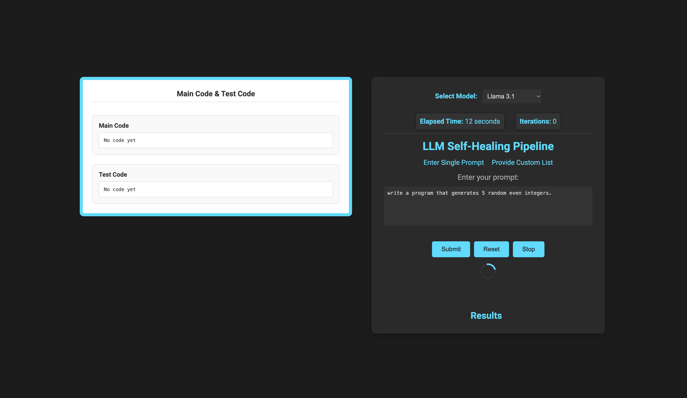
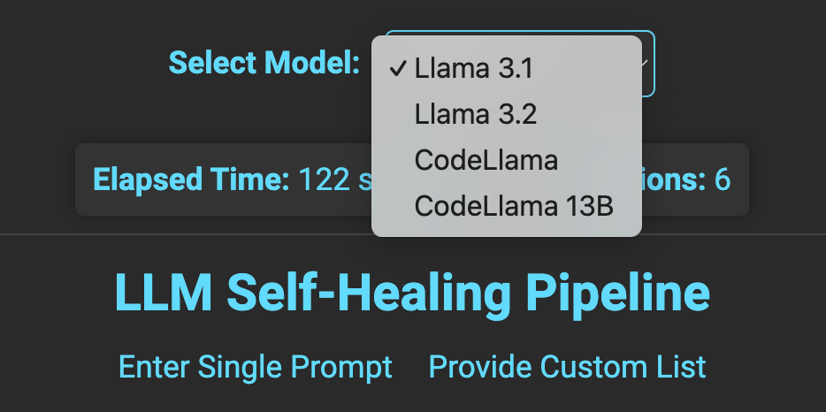
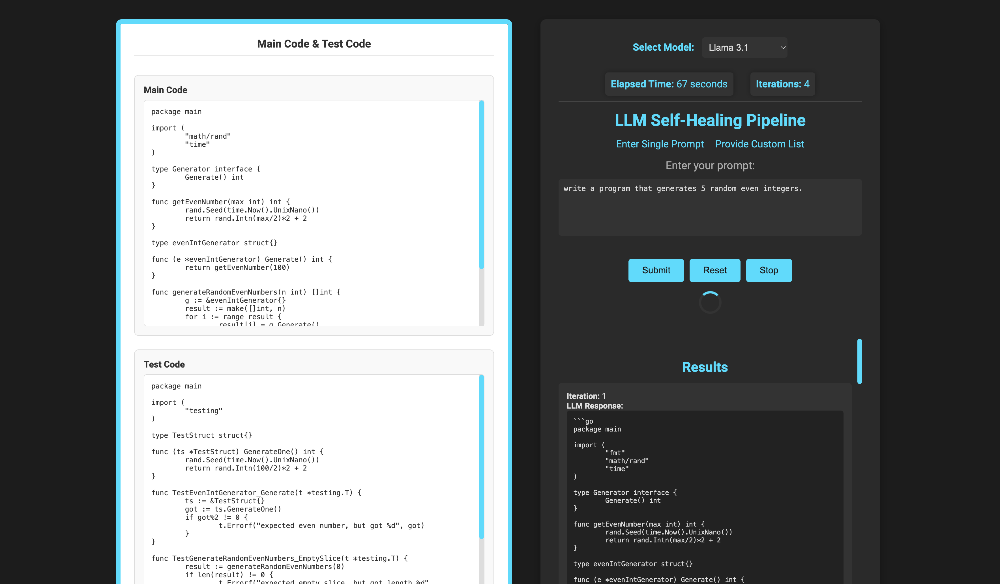
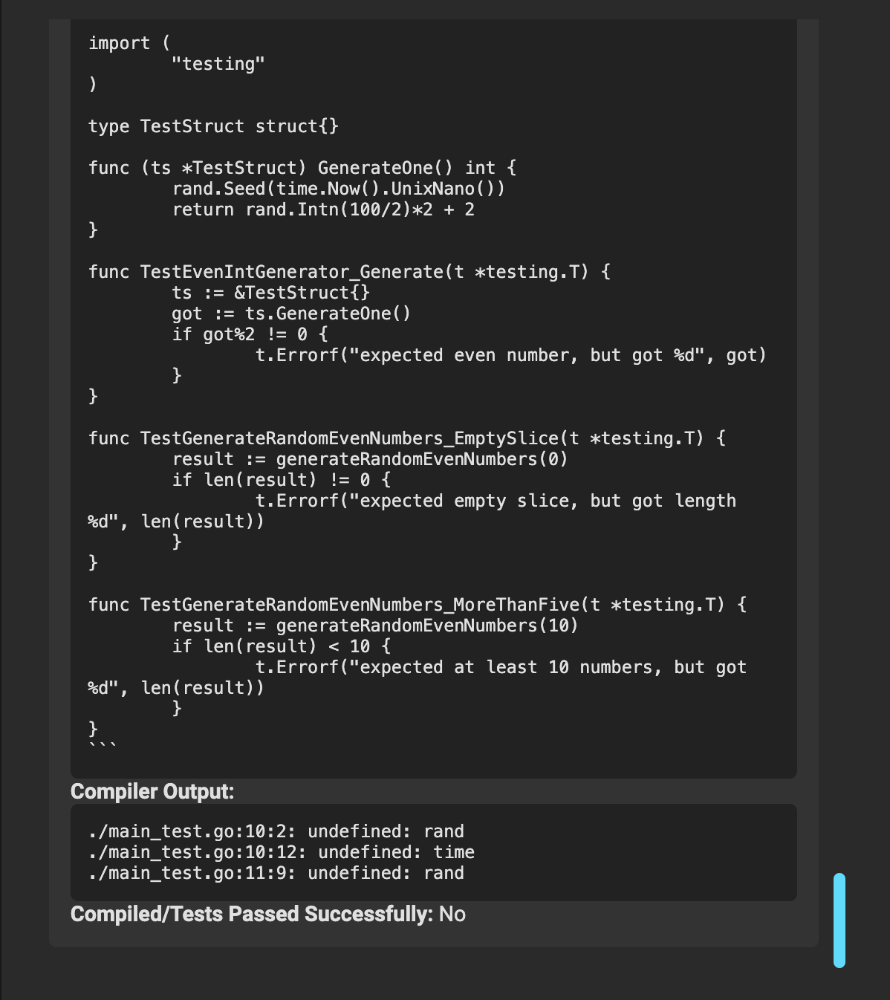

# Self-Healing LLM Pipeline

**Self-Healing LLM Pipeline** uses open-source Large Language Models (LLMs), like `llama3.1`, to iteratively generate, test, and refine code. It automates the process of identifying and fixing issues in generated code through a feedback loop, minimizing the need for human intervention. This application supports integration with **Ollama** for model management and API interactions.

- The LLM validates its generated main code by writing three test cases.
- Separates the main code and test code, saving them in respective files.
- The main code is compiled first; if it fails, the errors are fed back to the LLM.
- If the main code compiles, the test cases are compiled and executed, and if any error within the test file or any failed tests exists, they are returned as feedback.
- This loop continues until the code:
  - Compiles successfully
  - Passes all three test cases.

## Features

- **Iterative Self-Healing Loop**: Automatically generates, tests, and refines code until it compiles successfully.
- **Flexible Model Selection**: Choose between models like `llama3.1`, `codellama`, and `codellama:13b`.
- **Dual Modes of Operation**:
  - **Single Prompt**: Submit a single prompt and observe the LLM's iterative process.
  - **Prompt List**: Upload a list of prompts to process sequentially.
- **Detailed Metrics**: Tracks elapsed time, number of iterations, and results for each prompt.
- **Persistent Model Management**: Integrates with **Ollama** for managing models and API requests.

## Prerequisites

Before setting up the project, ensure the following are installed on your machine:

- [Go 1.19+](https://golang.org/dl/)
- [Docker](https://www.docker.com/get-started)
- [Ollama](https://ollama.com/) (running on the host machine)
- Access to the required LLM models, such as `llama3.1`.

## Installation

### Clone the Repository

```bash
git clone https://github.com/your-username/llm-self-healing-pipeline.git
cd llm-self-healing-pipeline
```

### Run the application locally:

To run the application locally without Docker:
1.	Install Go dependencies:
```bash
go mod tidy
```
2.	Run the application:
```bash
go run main.go
```

4.	Access the application at http://localhost:8080.
   
### Build and Run with Docker

```bash
docker build -t llm-pipeline .
```

### Run the Docker Container 
Mount your host’s Ollama directory to the container for model access:

```bash
docker run -d \
    -p 8080:8080 \
    -p 11434:11434 \
    -v /Users/username/.ollama:/root/.ollama \
    --name llm-pipeline \
    llm-pipeline

```
• p 8080:8080: Exposes the web interface for interacting with the application.
•	-p 11434:11434: Exposes Ollama’s API for model interactions.
•	-v /Users/ammarahmed/.ollama:/root/.ollama: Maps the Ollama model directory for persistent access.


### Verify the Setup:
- Access the web interface at http://localhost:8080.
- Use the Single Prompt or Prompt List mode to interact with the application.


### Usage

#### Single Prompt Mode

1.	Navigate to the Single Prompt section in the UI.
2.	Enter a prompt and select a model from the dropdown.
3.	Click Submit to start the iterative process.
4.	Observe:
	- The generated code.
	- Compiler output.
	- Progress metrics such as iterations and elapsed time.

#### Prompt List Mode

1.	Navigate to the Prompt List section in the UI.
2.	Upload a .txt file containing prompts, one per line.
3.	Select a model from the dropdown and start processing.
4.	The application will process each prompt sequentially and display results.

#### Monitoring Metrics

- Elapsed Time: Total time spent on processing.
- Iterations: Number of iterations performed for the current prompt.

### Technical Details

#### Project Structure

```
project-root/
├── Dockerfile                     # Containerization setup
├── main.go                        # Backend Go application
├── static/                        # Frontend assets (CSS, JS)
├── imgs/
├── templates/
│   └── index.html                 # Frontend HTML template
├── go.mod                         # Go module dependencies
├── go.sum                         # Go module checksums
└── modules/                       # Core modules for LLM processing and utilities
    ├── compiler/                  
    ├── compiler_v2/
    │   ├── consts/                # Constants for compiler configurations
    │   ├── go_compiler_v2/        # Go-specific compiler logic
    │   ├── platform/              # Cross-platform handling
    │   ├── rust_compiler_v2/      # Rust-specific compiler logic
    │   └── utils/                 # Utility functions for compiler operations
    ├── database/                  
    │   ├── db.go                  # Database logic and configuration
    │   └── test_db.go             # Unit tests for database interactions
    ├── display-indicator/         
    │   └── indicator.go           # Display indicators and loading animations
    ├── extraction/                
    │   ├── extract.go             # Extraction logic for code from LLM response
    │   └── extract_test.go        # Unit tests for extraction functions
    └── ollama-implementation/     
        ├── ollama.go              # Ollama API interaction logic
        └── ollama_test.go         # Unit tests for Ollama API functions
```


## Screenshots

### Main Interface with Prompt Input and Model Selection



### Model Selection Dropdown



### Code Generation Process with Main Code and Test Code Sections



### Detailed Output with Compiler Messages



### License

## License

This project is licensed under the MIT License. See the [LICENSE](LICENSE) file for details.
